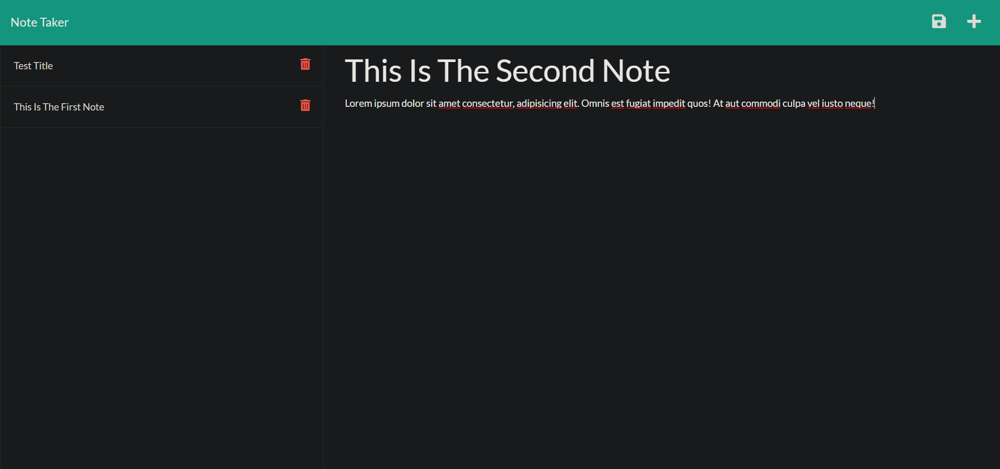

# Note-Taker

I wrote this application to provide a way to make and store notes. 

Building this application was a valuable learning exprience, primarily in Node.js and Express.js. File organization and file structure were key to make this application function properly. This application was also a valuable learning experience in back-end to front-end integration. Finally, deployment to Heroku required learning Heroku CLI, new terminal commands, and Heroku login.  

## Installation

This is a web-based application. To use, navigate to:  
https://gs-note-taker.herokuapp.com/

## Usage

To use the application enter a note title, then enter the note content. Once finished click on the save icon located in the top right of the application. The title of the saved note will appear in the left-hand column. 

## License
MIT